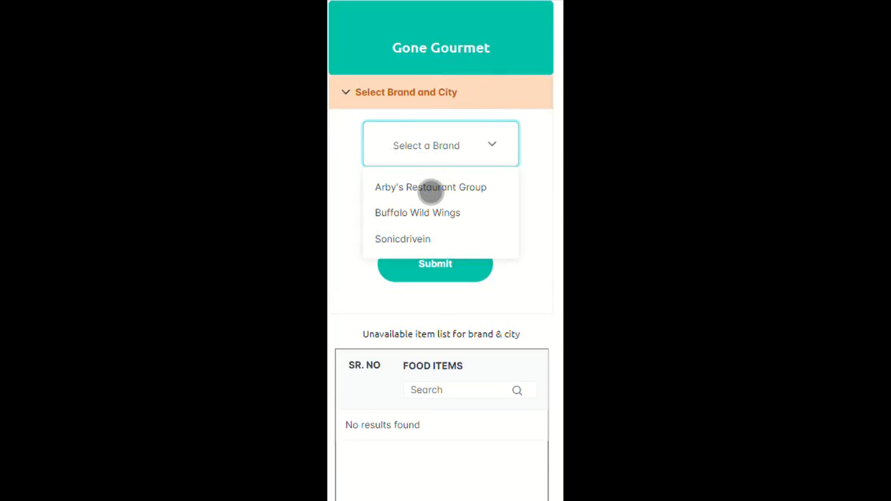

**[Gone Gourment]{.underline}**

**Objective:** The goal of this use case is to help the RAP (Retail
Analysis Platform) system quickly find out which items are not available
in stores. This is done by creating a special tool, called a bulk API,
which lets the RAP system ask the IDP (Item Data Provider) system for
this information. The RAP system can ask for the unavailable items at
specific store locations. When the RAP system asks, the IDP system will
either give back the list of items that are unavailable, or it will say
there was a problem. This tool also lets the RAP system ask about many
store locations at once, but we need to make sure it works well when we
test it with a lot of locations at once.

**Backend Requirements:**

1.  **API Endpoint for Retrieving Unavailable Items:**

    -   The backend shall provide an API endpoint that allows the RAP
        system to request information about unavailable items at
        specific store locations.

2.  **Input Parameters:**

    -   The API endpoint shall accept the following parameters:

        -   Restaurant Brand: The selected restaurant brand for which
            the unavailable items are requested.

        -   Location: The specific location within the selected
            restaurant brand.

3.  **Functionality:**

    -   **Restaurant Selection:**

        -   User can choose a restaurant from the available options.

        -   Backend retrieves restaurant data from the database.

    -   **Location Selection:**

        -   Based on the chosen restaurant, the user can select a
            specific location.

        -   Backend dynamically updates the available locations based on
            the selected restaurant.

    -   **Unavailable Items Retrieval:**

        -   Upon selection of restaurant and location, the backend
            fetches the list of unavailable items for that specific
            location.

        -   Retrieves data from the database based on the selected
            restaurant and location.

4.  **Data Retrieval Process:**

    -   Upon receiving a request, the backend shall query the IDP system
        to retrieve the list of unavailable items for the specified
        restaurant brand and location.

5.  **Handling Multiple Locations:**

    -   The backend shall support querying for unavailable items across
        multiple store locations simultaneously.

    -   It should efficiently handle large sets of location data to
        ensure optimal performance.

6.  **Response Format:**

    -   The backend shall respond with a JSON object containing the
        following information:

        -   Unavailable Items: A list of items that are not available at
            the specified restaurant location.

        -   Error Handling: In case of any errors during the data
            retrieval process, appropriate error messages shall be
            returned.

**Frontend Requirements:**

1.  **Brand Selection Dropdown:**

    -   Display a dropdown menu containing a list of available
        restaurant brands.

    -   User can select a brand from the dropdown.

2.  **City Selection Dropdown:**

    -   Display a dropdown menu containing a list of cities associated
        with the selected restaurant brand.

    -   The list of cities dynamically updates based on the selected
        restaurant brand.

    -   User can select a city from the dropdown.

3.  **Submit Button:**

    -   Display a submit button for the user to confirm their selection
        of restaurant brand and city.

4.  **Unavailable Items Card:**

    -   Upon clicking the submit button, display a card showing the list
        of unavailable items.

    -   Include a search bar at the top of the card for users to search
        for specific unavailable items.

    -   Display each unavailable item with its name and reason for
        unavailability.

5.  **Functionality:**

    -   **Brand Selection Interaction:**

        -   When a brand is selected, dynamically update the list of
            cities in the city dropdown based on the selected brand.

    ```{=html}
    <!-- -->
    ```
    -   **City Selection Interaction:**

        -   When a city is selected, update the available restaurant
            locations within that city.

    ```{=html}
    <!-- -->
    ```
    -   **Submit Button Interaction:**

        -   Upon clicking the submit button, trigger the request to
            fetch the list of unavailable items based on the selected
            restaurant brand and city.

        -   Display the unavailable items card with the retrieved data.

6.  **Search Functionality:**

    -   Allow users to search for specific unavailable items using the
        search bar.

    -   As the user types in the search bar, dynamically filter the
        displayed list of unavailable items to match the search query.

7.  **UI Design:**

    -   Ensure a clean and intuitive user interface design for the
        dropdowns, submit button, and unavailable items card.

    -   Use clear labels and visual cues to guide the user through the
        selection process.

{width="6.268055555555556in"
height="3.5256944444444445in"}{width="6.268055555555556in"
height="3.5256944444444445in"}

{width="6.268055555555556in"
height="3.5256944444444445in"}
